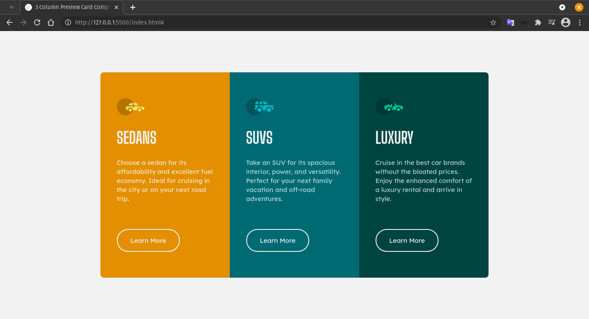

# Frontend Mentor - 3-column preview card component solution

This is a solution to the [3-column preview card component challenge on Frontend Mentor](https://www.frontendmentor.io/challenges/3column-preview-card-component-pH92eAR2-). Frontend Mentor challenges help you improve your coding skills by building realistic projects. 

## Table of contents

- [Overview](#overview)
  - [The challenge](#the-challenge)
  - [Screenshot](#screenshot)
  - [Links](#links)
- [My process](#my-process)
  - [Built with](#built-with)
  - [What I learned](#what-i-learned)
- [Author](#author)

## Overview

### The challenge

Users should be able to:

- View the optimal layout depending on their device's screen size
- See hover states for interactive elements

### Screenshot

### Links

<!-- Missing URL preview  -->

### Built with

- CSS custom properties
- Flexbox

### What I learned

In this project i learned how to use some css Units, like rem and em, vh and vw. 
A better use of BEM, and better responsivity in this project.  

## Author

- GitHub - [@Jesse-Snow](https://github.com/Jesse-Snow)
- Frontend Mentor - [@Jesse-Snow](https://www.frontendmentor.io/profile/Jesse-Snow)

